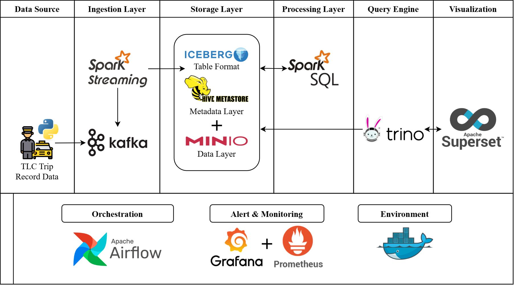

# TADOD - Data Lake Monitoring System

## Overview

This project presents a comprehensive Data Lake Monitoring Module designed to provide end-to-end observability and management capabilities for modern data lake architectures. The system integrates multiple industry-standard technologies to deliver real-time monitoring, alerting, and visualization of data pipeline operations.

## Architecture

| Component	| Description | Technologies |
|-----------|-------------|--------------|
| Data Sources | [NYC TLC taxi trip data](https://www.nyc.gov/site/tlc/about/tlc-trip-record-data.page) | Parquet files |
| Ingestion Layer | Data crawling, message brokering, and streaming | Kafka, Spark Streaming |
| Processing Layer | Data cleaning, transformation, and mart creation | Spark SQL, Iceberg |
| Storage Layer	| Object storage and metadata management | MinIO (S3-compatible), Hive Metastore |
| Query Layer | SQL query engine and visualization | Trino, Superset |
| Orchestration | Workflow management and scheduling | Airflow |
| Monitoring | Metrics collection, alerting, and visualization | Prometheus, Alertmanager, Grafana |

## Monitoring Endpoints

## Quickstart

Follow this [INSTRUCTIONS](assets/docs/instructions.md)
Create an issue for any problem, may be I can help ^^

## License

This project is licensed under the [Apache License](./LICENSE)
